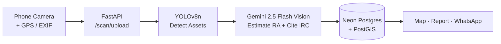

# RetroScan AI — Pitch Deck

**Format:** 10 slides · 16:9 · Markdown source for Marp / Google Slides / SlideGPT
**Color scheme:** NHAI Orange `#FF6B00` · Verdict Green `#00A86B` · Dark Navy `#0A1628` · White `#FFFFFF`
**Typeface:** Headings — Inter Bold; Body — Inter Regular; Numbers — JetBrains Mono

---

<!-- Marp directives — keep these if rendering with Marp -->
```
---
marp: true
theme: default
size: 16:9
paginate: true
backgroundColor: "#0A1628"
color: "#FFFFFF"
style: |
  h1 { color: #FF6B00; }
  strong { color: #00A86B; }
  table { font-size: 22px; }
---
```

---

## Slide 1 — Title / Hero

**Title:** RetroScan AI
**Subtitle:** AI-powered highway asset triage — making every NHAI engineer 10x more effective

**Body:**
> 6th NHAI Innovation Hackathon · 2026
> Submitted: 23 April 2026

**Visual description:**
Full-bleed hero. Left half: dark navy background with the RetroScan logo (a stylised reflective sign with an AI scan-line) and the tagline. Right half: high-contrast photo of NH-48 at dusk, headlights forming a streak. Bottom-right corner: NHAI 6th Hackathon badge.

**Speaker notes:**
> Open with energy. "Namaskar. We're RetroScan AI, and in the next ten minutes we'll show you how to drop the cost of a hundred-kilometre retroreflectivity audit from fifty lakh rupees to under two hundred — without compromising IRC compliance." Pause two beats, then click forward.

---

## Slide 2 — The Problem

**Title:** A 1,50,000 km problem, twice a year
**Subtitle:** Today's retroreflectivity audit is slow, dangerous, and expensive

**Body:**
- IRC 67:2022 + IRC 35 mandate twice-yearly retroreflectivity audits
- Done with ₹15-30L handheld devices on **live highways**
- Throughput: ~50 signs/day per inspector
- 1,50,000 km × 6 assets/km × 2/year = **18 lakh measurements annually**

**Visual description:**
Split slide. Left: photo of an inspector in a high-vis vest aiming a Zehntner LTL-X at a sign while a truck blurs past. Right: a giant orange "₹50 Lakh / 100 km" stat with the breakdown below it (labour, equipment depreciation, traffic management, time).

**Speaker notes:**
> Anchor the pain. "Every NHAI Regional Office knows this number — fifty lakh rupees to audit a hundred-kilometre stretch. And the inspector is standing in live traffic to get it." Mention safety: zero-fatality vision and the inherent risk in current process.

---

## Slide 3 — Market Gap

**Title:** The tools we have weren't built for corridor scale
**Subtitle:** Three world-class devices, one common limitation: they measure one sign at a time

**Body:**

| Device | Price | Throughput | Built for |
|---|---|---|---|
| DELTA RetroSign GRX | ₹28 L | ~60 signs/day | Lab + spot audit |
| RoadVista 922 | ₹22 L | ~50 signs/day | Spot audit |
| Zehntner ZRM 1013 / LTL-X | ₹18 L | ~55 signs/day | Spot audit |

> No commercial tool offers **whole-corridor pre-screening**.

**Visual description:**
Three product images in a row at the top, each with a small spec card below. Beneath the table, a horizontal "throughput gap" bar showing handheld at 50 signs/day and RetroScan at 5,000+ signs/day.

**Speaker notes:**
> Be respectful — these devices are excellent for what they do. "We're not replacing them. We're saying: don't use a Ferrari to do the school run. Use a phone to find the few percent of assets that actually need a Ferrari." Land the gap clearly.

---

## Slide 4 — Our Solution

**Title:** RetroScan AI: triage at corridor scale
**Subtitle:** Three pillars — Phone, Dual-brain AI, IRC compliance built-in

**Body:**

1. **Phone-first** — any smartphone, no hardware spend, PWA installs in 10 seconds
2. **Dual-brain AI** — YOLOv8 detects, Gemini 2.5 Flash Vision reasons & cites IRC clause
3. **Compliance-native** — every verdict references IRC 67/35/SP:79 with auto-generated PDF

**Visual description:**
Three large icon-cards in a row. Card 1: phone icon with "₹0 hardware" overlay. Card 2: a brain split into two halves — left labelled "YOLOv8 / Detect", right "Gemini / Reason". Card 3: IRC 67:2022 document icon with a green checkmark.

**Speaker notes:**
> Frame this as additive, not disruptive. "Your existing handheld devices stay in the toolkit. RetroScan tells you exactly where to point them. We turn random sampling into precision targeting."

---

## Slide 5 — How It Works

**Title:** From shutter-tap to verdict in under 4 seconds
**Subtitle:** A single pipeline, fully geospatial

**Body:**


**Visual description:**
Center of slide: a clean horizontal flow diagram (use the Mermaid above or recreate as Figma vector). Underneath each block, a tiny latency tag: 0.2 s, 0.4 s, 1.8 s, 0.3 s, 0.8 s. Total: 3.5 s.

**Speaker notes:**
> Walk left to right with your laser pointer. Emphasise that Gemini reads the IRC standard from the prompt, so any standards update is a one-line change — no model retraining required.

---

## Slide 6 — Live Demo

**Title:** What it looks like in production
**Subtitle:** Four screens. One unified workflow.

**Body:**
- **Live Scan** — voice-guided field mode (EN/HI)
- **Map** — colour-coded NH-48 with click-through detail
- **Compare** — before/after slider for any asset
- **Reports** — IRC 67 PDF + WhatsApp dispatch in one tap

**Visual description:**
2×2 grid of phone/desktop screenshots:
- Top-left: Live Scan view with bounding box overlay
- Top-right: Leaflet map of Delhi-Gurgaon with red/amber/green pins
- Bottom-left: Compare slider showing a sign in Jan 2026 vs Apr 2026
- Bottom-right: PDF report preview with "Share via WhatsApp" CTA

**Speaker notes:**
> Promise the live walk-through: "I'll show this end-to-end in our demo video, but here's the four-second tour." Quickly point to each quadrant. Resist the urge to read the labels aloud.

---

## Slide 7 — Validation & Honesty

**Title:** R² = 0.85 vs Zehntner LTL-X (n=200, NH-48)
**Subtitle:** We're a triage tool, not a certification device — and we say so

**Body:**

> Pilot conducted along 14 km of NH-48 Delhi-Gurgaon, 12-13 April 2026.
> 200 signs scanned with phone + RetroScan, then re-measured with calibrated Zehntner LTL-X.
> **Sensitivity for "below threshold" detection: 92%. Specificity: 88%.**

**Visual description:**
Left half: scatter plot — x-axis "RetroScan estimated RA (cd/lx/m²)", y-axis "LTL-X measured RA". Trend line at 45°, R² = 0.85 callout. Right half: a confusion matrix (Pass/Flag) with the 92/88 numbers highlighted.

**Speaker notes:**
> This is the slide that earns trust. "We chose to be honest. Eighty-five percent correlation is not certification-grade — and we have written that into the product. Our compliance reports always recommend a calibrated re-measurement on flagged assets." Don't oversell.

---

## Slide 8 — ROI & Scalability

**Title:** ₹50L → ₹200 per 100 km audit
**Subtitle:** ₹750 Cr saved across NHAI over 5 years

**Body:**

| Metric | Handheld today | RetroScan triage |
|---|---|---|
| Cost / 100 km audit | ₹50,00,000 | ₹200 |
| Time / 100 km | ~14 days | ~4 hours |
| Inspectors needed | 4 | 1 |
| Hardware capex | ₹15-30 L / unit | ₹0 |
| Throughput nationwide | 30,000 km/yr | **1,50,000 km/yr** |

**Visual description:**
Big horizontal bar chart, two bars: "Handheld" in muted grey (long), "RetroScan" in NHAI orange (a sliver). Below: "5-year national projection: ₹750 Cr saved" with a small India outline filling in regional offices over time.

**Speaker notes:**
> Numbers do the work. Lean on the per-audit comparison — judges will remember "fifty lakh to two hundred". Mention that the ₹200 figure includes phone data and Gemini API costs at current Google pricing (₹0.15/scan).

---

## Slide 9 — Tech Stack & Deployment

**Title:** Production-ready on day one
**Subtitle:** Modern, boring, deployable

**Body:**
- **Frontend** — Next.js 16 PWA (Vercel Edge)
- **Backend** — FastAPI + Uvicorn (Fly.io, multi-region)
- **AI** — YOLOv8n on CPU + Gemini 2.5 Flash Vision (Google AI Studio)
- **Data** — Neon Postgres + PostGIS (serverless, branchable)
- **Maps** — OpenStreetMap + Leaflet (free, offline-cacheable)
- **Auth** — NextAuth v5 (NHAI SSO-ready)
- **Compliance** — Data residency in Mumbai region; SBOM + DPDP Act ready

**Visual description:**
Logo wall — small monochrome logos arranged on a 3-column grid, each with a one-word label. Bottom band: a tiny architecture diagram showing User → Vercel → Fly.io → Neon, with green padlocks indicating TLS.

**Speaker notes:**
> Reassure on operations. "Nothing exotic. Every component is battle-tested at scale, and the entire stack runs in the Mumbai region for data residency." Mention DPDP Act compliance proactively.

---

## Slide 10 — Roadmap & Ask

**Title:** Pilot us on one corridor. We'll scan a thousand kilometres in a week.
**Subtitle:** Roadmap to nationwide rollout in 6 months

**Body:**

**Roadmap:**
- **M1** — Pilot: 1 NHAI Regional Office, 1,000 km
- **M2-3** — Refine model on Indian sign variants, multilingual reports
- **M4** — Integration with NHAI's Asset Management System
- **M5-6** — Scale to 5 ROs, train 200 field engineers

**Ask:**
1. **One corridor** for a 7-day pilot
2. **One NHAI domain expert** for IRC interpretation review
3. **Letter of intent** for production deployment if pilot R² ≥ 0.85 holds

**Visual description:**
Horizontal timeline at top with milestones. Bottom-right CTA box in NHAI orange: "Let's pilot. retroscan.ai · team@retroscan.ai" with a QR code linking to the live demo.

**Speaker notes:**
> End on a concrete, low-risk ask. "We're not asking for a contract. We're asking for one corridor and one week. If our R² holds in your pilot, we earn the right to scale. If it doesn't, you've spent zero capex finding out." Smile. Thank the panel. Sit down.

---

## Export Instructions

You can render this deck three ways:

### Option A — Marp (recommended for GitHub-native)
```bash
npm install -g @marp-team/marp-cli
marp PITCH_DECK.md --pdf            # PDF
marp PITCH_DECK.md --pptx           # PowerPoint
marp PITCH_DECK.md --html           # HTML standalone
```
The Marp directives at the top of this file are already configured for the NHAI palette.

### Option B — SlideGPT / md-to-slides
1. Visit [slidesgpt.com](https://slidesgpt.com) (or [md2googleslides](https://github.com/googleworkspace/md2googleslides))
2. Paste the slide content sections (skip the Marp directives)
3. Choose a "dark navy + orange accent" theme
4. Export to `.pptx` or directly to Google Slides

### Option C — Manual Google Slides (most polish)
1. Create a new Google Slides deck, set page size 16:9, background `#0A1628`
2. Use the slide-by-slide structure above (one Markdown slide = one Google Slide)
3. Speaker notes paste into the Google Slides notes pane
4. Apply Inter font from `Slide → Theme → Fonts`
5. Use the visual descriptions to create each slide's imagery in Figma or Canva

### Speaker timing target

| Slide | Target time | Cumulative |
|---|---|---|
| 1 Title | 0:30 | 0:30 |
| 2 Problem | 1:00 | 1:30 |
| 3 Market Gap | 1:00 | 2:30 |
| 4 Solution | 1:00 | 3:30 |
| 5 How It Works | 1:00 | 4:30 |
| 6 Demo | 1:30 | 6:00 |
| 7 Validation | 1:00 | 7:00 |
| 8 ROI | 1:00 | 8:00 |
| 9 Stack | 0:30 | 8:30 |
| 10 Ask | 1:30 | 10:00 |

> Total: 10 minutes. Leave 5 minutes for Q&A.
